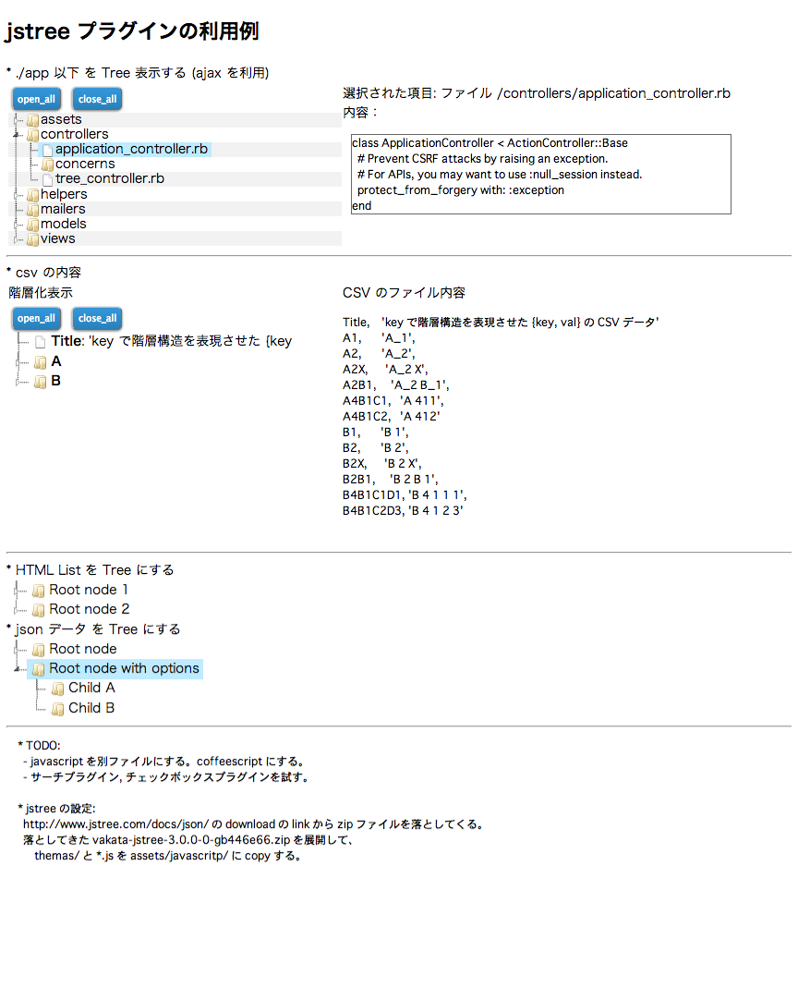

# jstree プラグインの利用例

```
$ bundle install
$ bundle exec rails s

$ rails s &
$ rspec
```

```
$ source ./setup.sh
$ rake assets:clobber
$ rake assets:precompile
$ rails s -e production
```

次のエラーメッセージ  
　　ERROR RuntimeError: Missing `secret_key_base` for 'production' environment, set this value in `config/secrets.yml`  
が出た場合、  
　　$ source ./setup.sh  
を実行すると解消する。


# スクリーンショット




# See also

- [Checkbox 'indeterminate' property detection demo](http://rupertwood.com/checkboxIndeterminateDemo/)

- [Is this possible to have checkbox only on the Leaf Nodes of JSTREE](https://groups.google.com/forum/#!topic/jstree/TqK2OzDv0qg)

- [JSTREE BOOTSTRAP THEME DEMO](http://orangehilldev.com/jstree-bootstrap-theme/demo/)

- [Is there a way to add extra columns to a jstree](http://www.questionhub.com/StackOverflow/4121214)

- [Query Treeview Plugin & Tutorials with Example](http://www.jqueryrain.com/demo/jquery-treeview/)

- [JqTree is a jQuery widget for displaying a tree structure in html](http://mbraak.github.io/jqTree/index.html)
